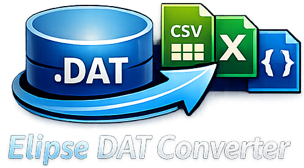
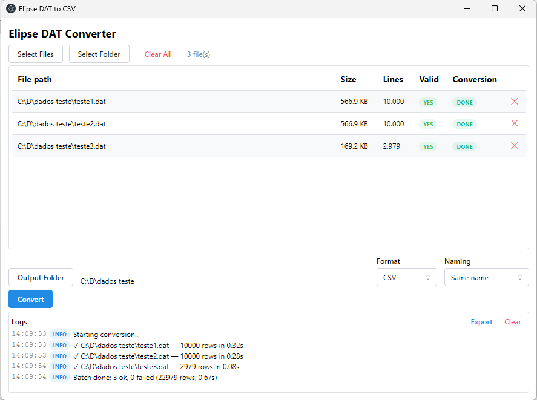

<div align="center">

[![License][badge-license]][link-license]
[![Build Status][badge-build]][link-build]

<br/>



<br/>

[![Electron][badge-electron]][link-electron]
[![React][badge-react]][link-react]
[![TypeScript][badge-typescript]][link-typescript]

### Desktop converter for Elipse SCADA `.dat` binary historian files

<br/>



<br/>

[![GitHub Issues][badge-issues]][link-issues]
[![GitHub Stars][badge-stars]][link-stars]

</div>

## Quick Start

Check out the [Getting Started](#getting-started) section for full instructions.

1. `npm install`
2. `npm run dev`
3. Drop your `.dat` files into the app window

<br/>

> [!NOTE]
> This application converts Elipse SCADA `.dat` binary historian files into **CSV**, **Excel (.xlsx)**, and **JSON** formats. It handles large files (>1 GB) via streaming I/O without loading them entirely into memory.

## Features

- **Multiple export formats** — CSV (RFC 4180), Excel (.xlsx), and JSON
- **Batch conversion** — process multiple files sequentially with progress tracking
- **Drag and drop** — drop `.dat` files or folders directly into the app
- **Folder discovery** — recursively finds all `.dat` files in a selected folder
- **File validation** — checks the magic header (`0xa7eda5db`) before conversion
- **Streaming I/O** — handles large files (>1 GB) without loading them into memory
- **Pluggable architecture** — extensible parser and exporter registries
- **Cross-platform** — builds for Windows (NSIS installer) and Linux (AppImage/deb)

## Links

- [Getting Started](#getting-started)
- [Supported Column Types](#supported-column-types)
- [Output Naming Patterns](#output-naming-patterns)
- [Project Structure](#project-structure)
- [Tech Stack](#tech-stack)
- [Development](#development)
- [Contributing](#contributing)
- [Copyright and License](#copyright-and-license)

## Supported Column Types

| Type     | Code | Decoding                            |
|----------|------|-------------------------------------|
| DateTime | 8    | DoubleLE at offset+2, ×1000 → Date |
| String   | 9    | Latin1, null-terminated, trimmed    |
| Word     | 3    | Int16LE                             |
| Float    | 6    | FloatLE                             |

## Output Naming Patterns

| Pattern        | Example                              |
|----------------|--------------------------------------|
| same-name      | `plant_01.dat` → `plant_01.csv`      |
| tag-separated  | `plant_01.dat` → `plant_01_tags.csv` |
| merged-output  | All files → `merged_output.csv`      |

## Getting Started

### Prerequisites

- Node.js 18+
- npm

### Install

```bash
npm install
```

### Run in Development

```bash
npm run dev
```

### Run Tests

```bash
npm test
```

### Build

```bash
# Windows
npm run build:win

# Linux
npm run build:linux

# Both
npm run build:all
```

Build artifacts are output to the `dist/` directory.

## Project Structure

```
src/
├── shared/
│   └── ipcChannels.ts            # IPC channel name constants (used by main + preload)
├── core/                         # Converter engine (platform-independent)
│   ├── index.ts                  # Barrel export — public API
│   ├── types/                    # Type definitions and contracts
│   │   ├── data.ts              # Domain data models and enums
│   │   ├── config.ts            # Operational types (ConversionConfig, BatchResult, etc.)
│   │   └── contracts.ts         # Behavioral interfaces (InputParser, Exporter, registries)
│   ├── parsers/                  # Input format parsers
│   │   ├── datParser.ts         # .dat binary file parser (streaming)
│   │   └── parserRegistry.ts   # Pluggable input parser registry
│   ├── exporters/                # Output format writers
│   │   ├── csvExporter.ts       # CSV output (fast-csv)
│   │   ├── jsonExporter.ts      # JSON output (streaming array)
│   │   ├── excelExporter.ts     # Excel output (exceljs streaming)
│   │   └── exporterRegistry.ts  # Pluggable exporter registry
│   ├── utils/                    # Support utilities
│   │   ├── errors.ts            # Custom error classes
│   │   ├── fsUtils.ts           # Filesystem helpers
│   │   └── resolveOutputPath.ts # Output path naming patterns
│   ├── converter.ts              # Single file conversion orchestration
│   └── conversionManager.ts      # Batch orchestration + cancellation
├── main/                         # Electron main process
│   ├── index.ts                  # App entry, window creation
│   └── ipc/
│       ├── index.ts              # Registers all IPC handlers
│       ├── dialogHandlers.ts     # File/folder dialog handlers
│       ├── fileHandlers.ts       # File validation, info, discovery
│       └── conversionHandlers.ts # Conversion start, cancel, event relay
├── preload/                      # Electron preload (context bridge)
│   ├── index.ts                  # Exposed API (uses IPC channel constants)
│   └── index.d.ts                # Type declarations for renderer
└── renderer/                     # React UI
    ├── index.html
    └── src/
        ├── main.tsx              # React entry + MantineProvider
        ├── App.tsx               # App shell (uses useConversion hook)
        ├── types.ts              # UI-only types
        ├── hooks/
        │   └── useConversion.ts  # Custom hook for conversion state management
        └── components/
            ├── FileSelection.tsx      # File/folder picker + drag-drop
            ├── SettingsPanel.tsx       # Format, naming, output dir
            ├── ConversionControls.tsx  # Convert/cancel + progress bar
            └── LogPanel.tsx           # Scrollable log console
```

## Tech Stack

- **Electron** + **electron-vite** — desktop app framework and build tooling
- **React 19** + **Mantine 7** — UI components
- **TypeScript 5** — strict mode throughout
- **fast-csv** — RFC 4180 CSV serialization
- **exceljs** — streaming .xlsx generation
- **vitest** + **fast-check** — testing and property-based testing
- **electron-builder** — packaging and distribution

## Development

If you want to run the latest code from git, here's how to get started:

1. Clone the code:

    ```bash
    git clone https://github.com/nicedoc/elipse-dat-to-csv.git
    cd elipse-dat-to-csv
    ```

2. Install dependencies:

    ```bash
    npm ci
    ```

3. Build the code:

    ```bash
    npm run build
    ```

4. Run:

    ```bash
    npm run dev
    ```

## Copyright and License

Elipse DAT to CSV Converter is licensed under the [MIT License](LICENSE).

<!-- Badge images -->
[badge-license]: https://img.shields.io/badge/License-MIT-blue.svg?color=3F51B5&style=for-the-badge&label=License&logoColor=000000&labelColor=ececec
[badge-build]: https://img.shields.io/github/actions/workflow/status/nicedoc/elipse-dat-to-csv/ci.yml?branch=main&label=Build%20Status&style=for-the-badge
[badge-electron]: https://img.shields.io/badge/Electron-33-47848F.svg?style=for-the-badge&logo=electron&logoColor=47848F&labelColor=ececec
[badge-react]: https://img.shields.io/badge/React-19-61DAFB.svg?style=for-the-badge&logo=react&logoColor=61DAFB&labelColor=ececec
[badge-typescript]: https://img.shields.io/badge/TypeScript-5-3178C6.svg?style=for-the-badge&logo=typescript&logoColor=3178C6&labelColor=ececec
[badge-issues]: https://img.shields.io/github/issues/nicedoc/elipse-dat-to-csv?style=for-the-badge&labelColor=ececec
[badge-stars]: https://img.shields.io/github/stars/nicedoc/elipse-dat-to-csv?style=for-the-badge&labelColor=ececec

<!-- Badge links -->
[link-license]: https://opensource.org/licenses/MIT
[link-build]: https://github.com/nicedoc/elipse-dat-to-csv/actions?query=branch%3Amain
[link-electron]: https://www.electronjs.org/
[link-react]: https://react.dev/
[link-typescript]: https://www.typescriptlang.org/
[link-issues]: https://github.com/nicedoc/elipse-dat-to-csv/issues
[link-stars]: https://github.com/nicedoc/elipse-dat-to-csv/stargazers
